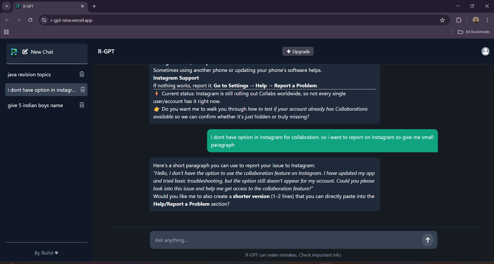

# R-GPT

R-GPT is an AI-powered chat application inspired by ChatGPT, built using **React**, **Node.js**, **Express**, and **MongoDB**.  
It supports conversation history, thread management, and an interactive UI for a smooth user experience.

**Live demo:** https://r-gpt-nine.vercel.app/

---

## 🚀 Features
- 💬 Real-time AI chat interface  
- 📜 Conversation history with thread support  
- ⚡ Fast backend with Node.js and Express  
- 📦 MongoDB integration for storing chats  
- 🌙 Dark theme UI  

---

## 🛠️ Tech Stack
- **Frontend:** React, TailwindCSS, Vite  
- **Backend:** Node.js, Express.js  
- **Database:** MongoDB  
- **Version Control:** Git & GitHub  

---

## 📂 Project Structure
```bash
R-GPT/
├── frontend/   # React frontend
├── backend/    # Node.js backend
├── .gitignore 
└── README.md
```

## ⚙️ Installation & Setup

```bash
git clone https://github.com/ROHIT-JINJALA/R-GPT.git
cd R-GPT

```

**1.** Backend Setup

```bash
cd backend
npm install
node server.js
```
Create a .env file inside the backend/ folder and add:
``` bash
PORT=8080
OPENAI_API_KEY=your_openai_key
MONGODB_URI=your_mongodb_url

```

**2.** Frontend Setup

```bash
cd frontend
npm install
npm run dev
```
Create a .env file inside the frontend/ folder and add:
```bash
VITE_SERVER_URI=http://localhost:8080
```

## 🖼️ Screenshots

